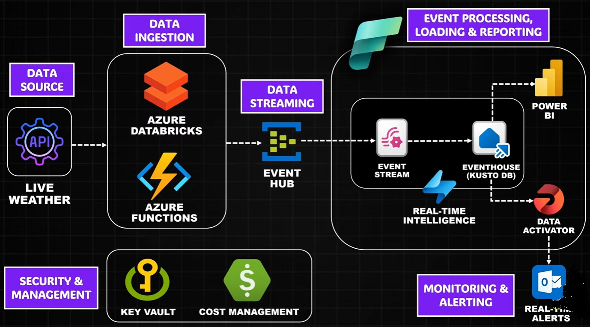

# **Project Overview** #

This project implements a **real-time data streaming and analytics** solution built on **Microsoft Azure** to monitor live weather conditions and deliver actionable insights. Weather data is continuously collected from a live weather API using **Azure Databricks** and **Azure Functions**, then streamed through **Azure Event Hub** for reliable, low-latency ingestion.

The streaming data is processed and stored in an **Eventhouse (Kusto database)** via **Event Stream**, enabling high-performance querying and real-time analytics. **Power BI** provides interactive dashboards for visualizing weather patterns and trends as they occur. To ensure proactive monitoring, **Data Activator** triggers automated alerts and notifications through **Outlook** when critical weather thresholds are detected.

The solution follows cloud best practices with secure secret management using **Azure Key Vault** and optimized resource usage through **Azure Cost Management**, delivering a scalable, secure, and cost-efficient real-time analytics platform.

## **Pipeline Architecture** ##
